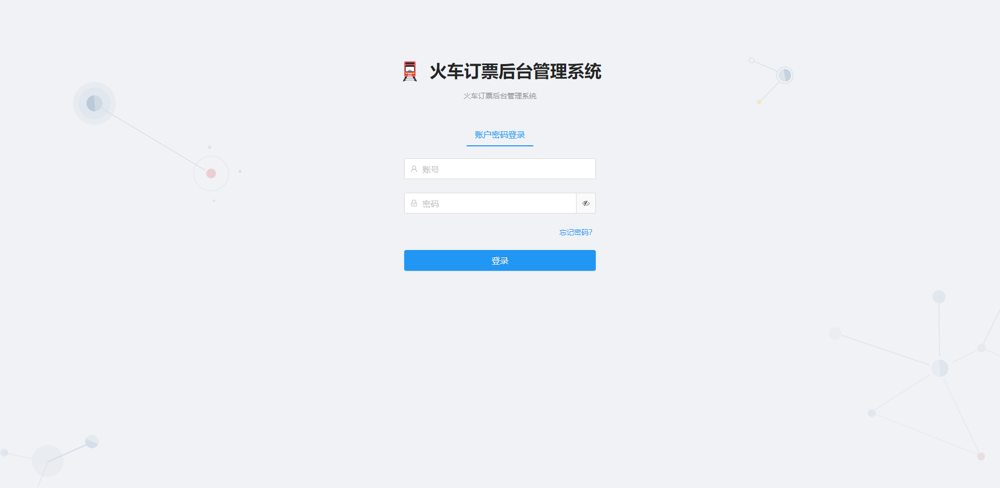
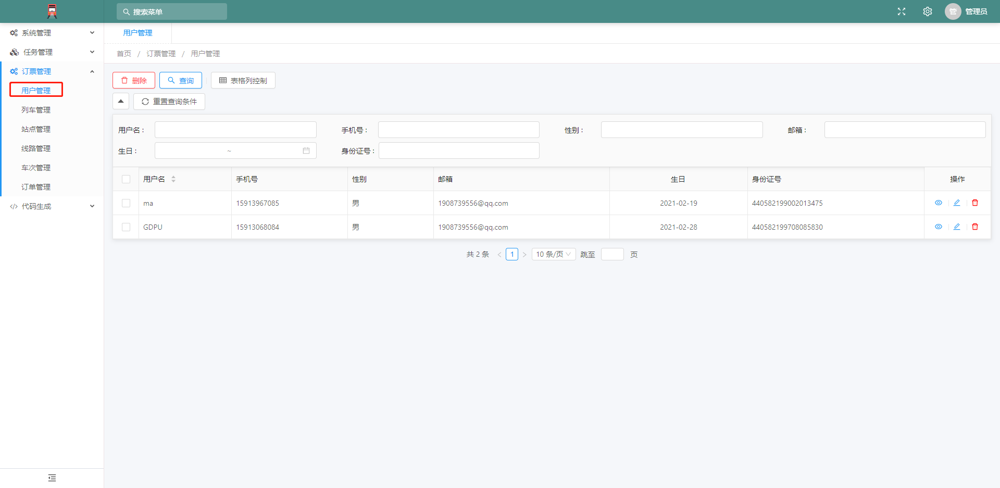
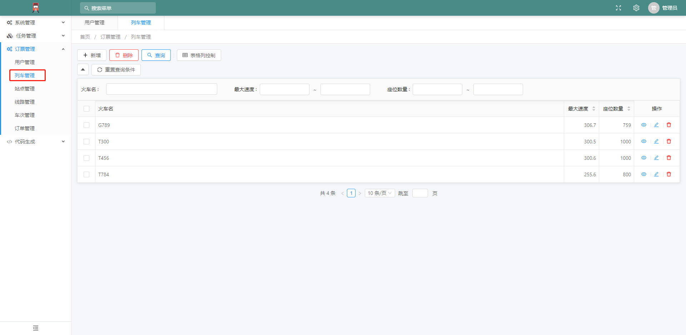
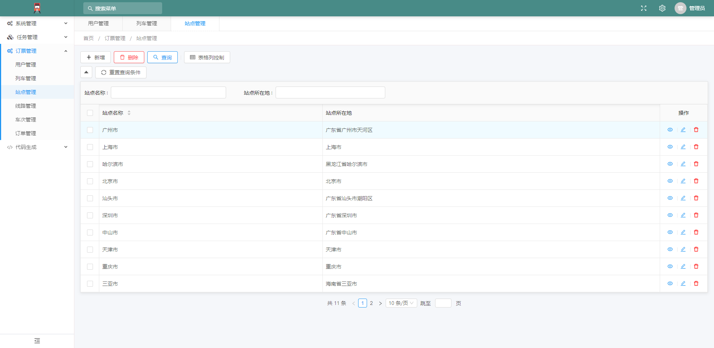
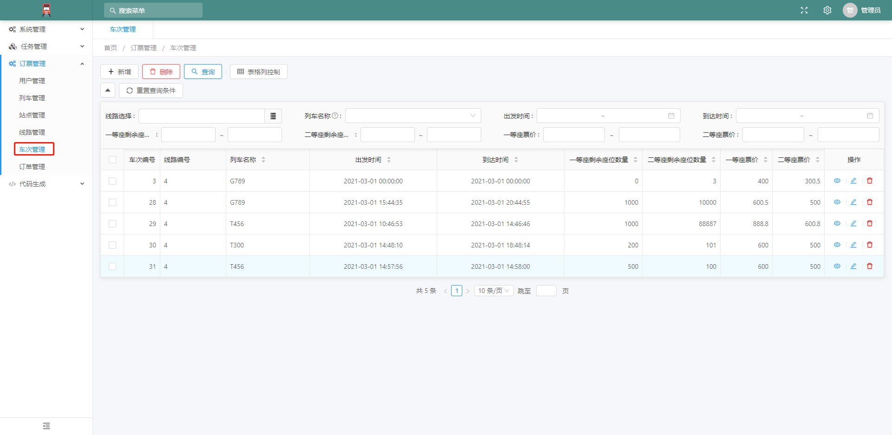
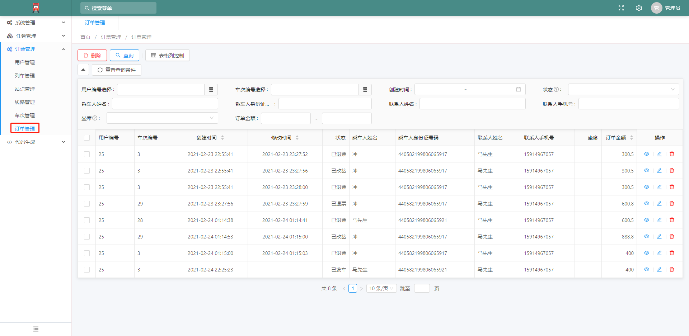
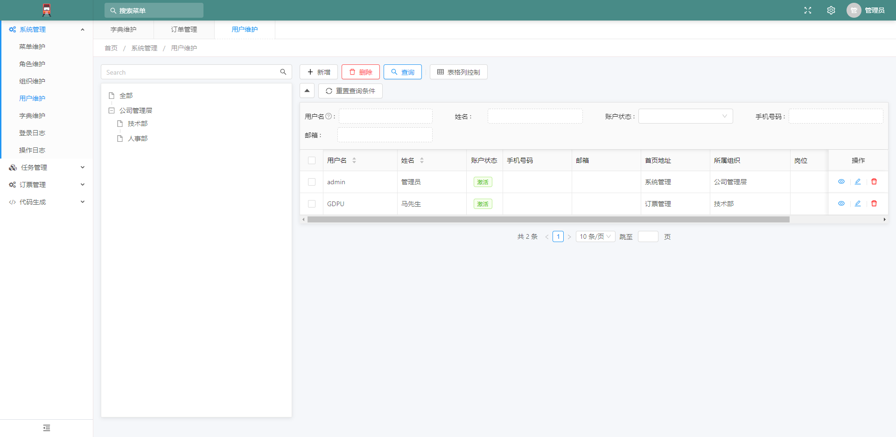
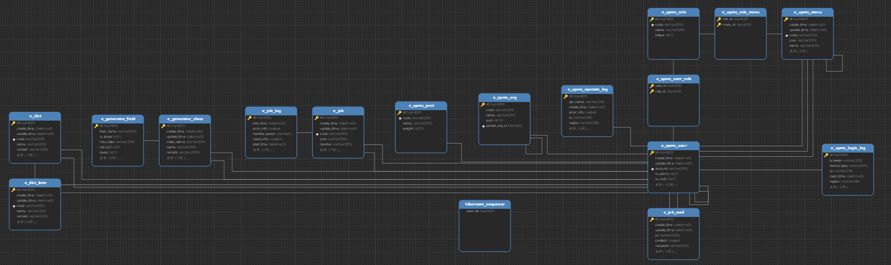
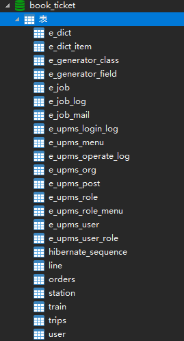

# bookticket-admin
### 项目简介
此项目是 [订票系统](https://github.com/Yong-Ma/bookticket)的后台管理系统，包含基本的管理功能，使用了开源框架 [Erupt](https://github.com/erupts/erupt) 。Erupt 是一个低代码 **全栈类** 框架，它使用 **Java 注解** 动态生成页面以及增、删、改、查、权限控制等后台功能。Erupt文档地址：https://www.yuque.com/erupts/erupt

--------

### 环境部署

##### 开发工具

|  工具   |      说明      |                  官网                   |
| :-----: | :------------: | :-------------------------------------: |
|  IDEA   |    开发IDE     | https://www.jetbrains.com/idea/download |
| Navicat | 数据库连接工具 |   http://www.formysql.com/xiazai.html   |
| Typora  | Markdown编辑器 |           https://typora.io/            |

##### 开发环境

| 工具  |   版本号   |                             下载                             |
| :---: | :--------: | :----------------------------------------------------------: |
|  JDK  | 1.8.0_ 92+ | https://www.oracle.com/technetwork/java/javase/downloads/jdk8-downloads-2133151.html |
| Mysql |    5.7     |                    https://www.mysql.com/                    |

##### 搭建步骤

1.创建数据库，运行`sql`文件

2.在application.yml里的datasource修改为自己的用户名和密码

```
#数据源配置
spring:
  datasource:
    url: jdbc:mysql://localhost:3306/book_ticket?useUnicode=true&characterEncoding=UTF-8&serverTimezone=Asia/Shanghai
    username: root
    password: admin
```

3.在application.yml里的mail修改username和password,其中password不是邮箱密码，而是授权码，**获取方法**-> <u>登陆网易163邮箱，在设置中打开并勾选POP3/SMTP/IMAP服务，然后会得到一个授权码，这个邮箱和授权码将用作登陆认证。</u> 如果是使用qq邮箱还得修改host

```
  #邮箱配置
  mail:
    username: *****@163.com
    password: ****
    host: smtp.163.com
```

4.可通过IDEA打开项目，运行springboot项目，打开网址：http://localhost:8088/

5.输入用户名GDPU，密码GDPU,或者用户名admin，密码admin `(admin具有更高权限)`进行登陆

PS:如果有问题，可尝试删除.erupt文件

### 项目截图

###### 登陆页面



###### 用户管理



###### 列车管理



###### 站点管理



###### 线路管理


###### 车次管理



###### 订单管理



###### 用户维护



------

### 数据库

###### 订票相关


###### 后台管理相关





--------------

### 说明 

1. 如果使用该项目出现问题，请联系我 15913967074@163.com
2. 如果该项目对您有帮助,请`star`鼓励我

